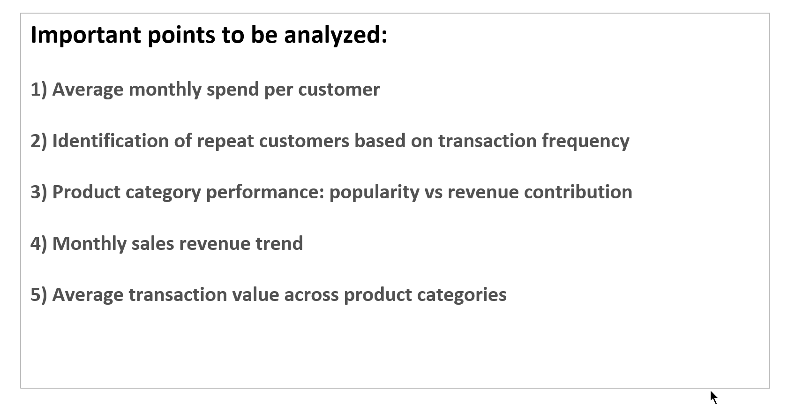

# Retail Sales Analysis (Excel Project)

## Project Overview

This project analyzes retail sales transaction data using Microsoft Excel to identify trends, customer behavior patterns, and category-level performance. The analysis focuses on transforming raw transactional data into meaningful business insights using pivot tables, charts, and structured analytical questions.

The goal of this project is to demonstrate practical data analysis skills including data preparation, aggregation, visualization, and insight generation using Excel.

## Dataset

- Source: Sample retail sales dataset

- Format: CSV (raw transactional data)

- Records: ~12,000 rows

- Fields include:

  - Transaction ID

  - Customer ID

  - Category

  - Item

  - Price per Unit

  - Quantity

  - Total Spend

  - Payment Method

  - Location

  - Transaction Date

  - Discount Applied

The raw dataset is preserved in its original format to maintain reproducibility of analysis.

## Analytical Questions Addressed

The analysis focuses on answering the following business questions:

1. What is the average monthly spend per customer?

2. Which customers are repeat buyers based on transaction frequency?

3. How do product categories perform in terms of popularity vs revenue contribution?

4. What is the monthly sales revenue trend?

5. What is the average transaction value across product categories?

## Tools & Techniques Used

- Microsoft Excel

- Pivot Tables

- Pivot Charts

- Data Aggregation

- Sorting & Filtering

- Basic Data Cleaning

- Conditional Formatting

- Business Insight Generation

## Key Insights

- Monthly revenue generally remained within the range of $40,000–$50,000 with periodic fluctuations.

- Certain customers showed high purchase frequency but lower transaction value, indicating different customer segments.

- The Butchers category generated the highest revenue despite lower transaction frequency, suggesting higher average transaction value.

- Milk Products showed high transaction frequency but comparatively lower average transaction value.

## Repository Structure

```
Retail-Sales-Analysis-Excel/
│
├── data/
│   └── retail_store_sales_raw.csv
│
├── analysis/
│   └── retail_store_sales_finished.xlsx
│
├── screenshots/
│   ├── Analytical_Questions.png
│   ├── Category_Analysis.png
│   ├── Monthly_Revenue_Trend.png
│   └── Key_Insights.png
│
└── README.md
```
## Screenshots

### Analytical Questions


### Category Analysis (Transaction Frequency & Revenue)


### Monthly Revenue Trend


### Key Insights Summary


## Learning Outcomes

- Structuring raw data for analysis

- Using pivot tables to answer business questions

- Translating data into actionable insights

- Presenting analysis clearly for stakeholders

## Future Improvements

- Recreate analysis using SQL for data querying

- Build an interactive dashboard using Power BI

- Extend analysis using Python for deeper statistical insights

## Author 

Retail Sales Analysis Project created as part of a data analysis learning portfolio.
